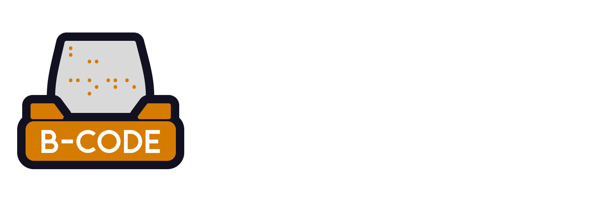

# B-Code
Work in progress - bug reports are welcome.

Text-to-braille GUI that generates G-code toolpaths for BrailleRAP-style printers.

## Quick Start (English)

### 1) Prerequisites
- Python 3.10+ recommended
- A virtual environment (recommended)
- USB serial/virtual COM drivers for your printer (if needed): https://ftdichip.com/drivers/vcp-drivers/

### 2) Install dependencies
```powershell
python -m venv .venv
.\.venv\Scripts\Activate.ps1
pip install -r requirements.txt
```

### 3) Run the editor
```powershell
python bcode\braille_editor.py
```

### 4) Basic workflow
1. Type or paste text into the left panel.
2. Select a profile in the toolbar (`English Grade 1`, `English Grade 2 (partial)`, or `French Grade 1`).
3. Adjust dot/cell/line spacing and review the physical page preview.
4. Export braille text or G-code, or send directly to the selected COM port.

> Note: French and English Grade 2 is currently partial/WIP.

## Quick Start (Français)

### 1) Prérequis
- Python 3.10+ recommandé
- Un environnement virtuel (recommande)
- Pilotes USB serie/port COM virtuel pour votre imprimante (si nécessaire) : https://ftdichip.com/drivers/vcp-drivers/

### 2) Installer les dépendances
```powershell
python -m venv .venv
.\.venv\Scripts\Activate.ps1
pip install -r requirements.txt
```

### 3) Lancer l'éditeur
```powershell
python bcode\braille_editor.py
```

### 4) Utilisation rapide
1. Saisissez ou collez votre texte dans le panneau de gauche.
2. Sélectionnez un profil dans la barre d'outils (`English Grade 1`, `English Grade 2 (partiel)` ou `French Grade 1`).
3. Ajustez l'espacement des points/cellules/lignes et vérifiez l'aperçu de page.
4. Exportez le braille ou le G-code, ou envoyez directement a l'imprimante via le port COM.

> Remarque : le braille français et le Grade 2 anglais sont en cours d'implémentation (WIP).
